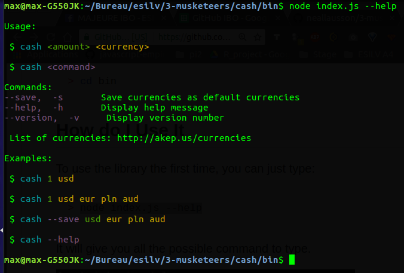

# Cash

The cash library will allow you to compute the value of a currency into another. It is a very simple tool that instantly gives you the result, just by typing a single command.
In this read me, you'll find:


## Getting Started

Clone the project with the command :

```
git clone https://github.com/MaximeRebillard/3-musketeers.git
```

Go into the project folder and write :
```
sudo apt-get install
```
It will install all the necessary packages for you.

## Prerequisites

Having installed nodejs on your computer.

### How do I Install Node.js


The first step to access the features of the library is to install node.js, otherwise, you'll get errors.

_ If you're a **Windows User**, then follow the steps on this [great tutorial](http://blog.teamtreehouse.com/install-node-js-npm-windows).

_ If you're a **Linux User**, then you'll prefer to take this [tutorial](https://doc.ubuntu-fr.org/nodejs) and start from "Depuis un Personal Package Archives (PPA) (dépôts officiels "nodesource")" to get the full extent of node.js

### Launch

Go into your project folder :

```
cd $project/cash/bin/
```

Firstly, for this command : the first argument is the price, by default the currency of the price is in usd.
```
node index.js 1
```

It will return :

✔ 0.81 (EUR) Euro
✔ 0.72 (GBP) Pound Sterling
✔ 3.38 (PLN) Polish Zloty


Now if we want to change the starting currency we can add the currency in the end

```
node index.js 1 usd
```
It will return :

✔ 0.81 (EUR) Euro
✔ 0.72 (GBP) Pound Sterling
✔ 3.38 (PLN) Polish Zloty


We can also specify the exiting currencies :

For example : to convert 1 JPY into : HKD and EUR, write :
```
node index.js 1 jpy hkd eur
```
As expected, it will return :

✔ 0.07 (HKD) Hong Kong Dollar
✔ 0.01 (EUR) Euro

As you can see, you can use the library in several ways.

If you need any help, just type :

```
node index.js --help
```


Do not forget that you need an internet connection, since we use an online API.

## Running the tests

Explain how to run the automated tests for this system
